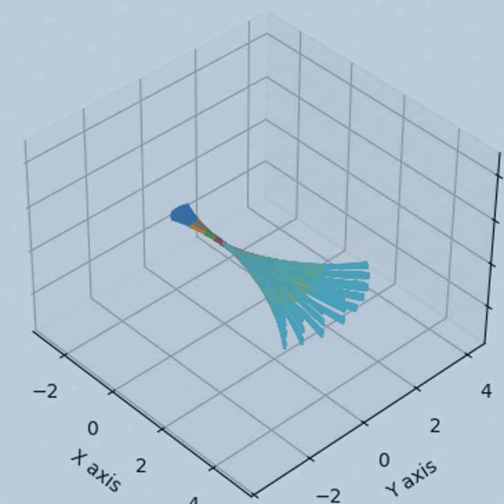
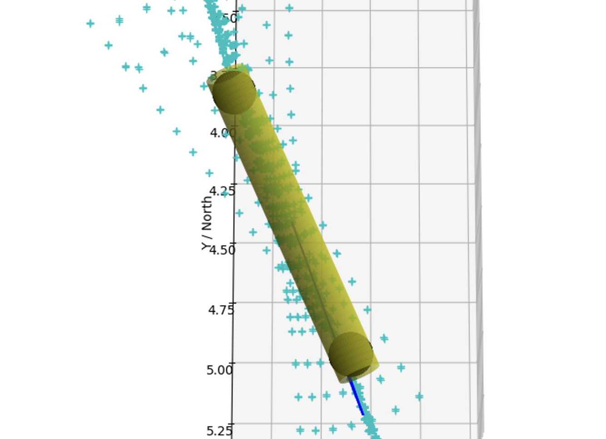
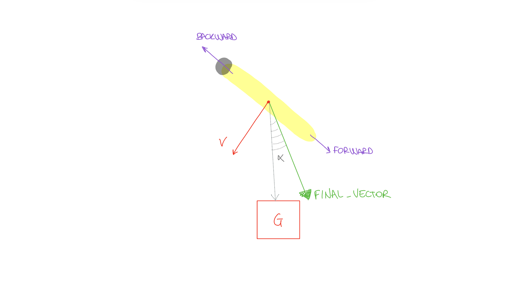
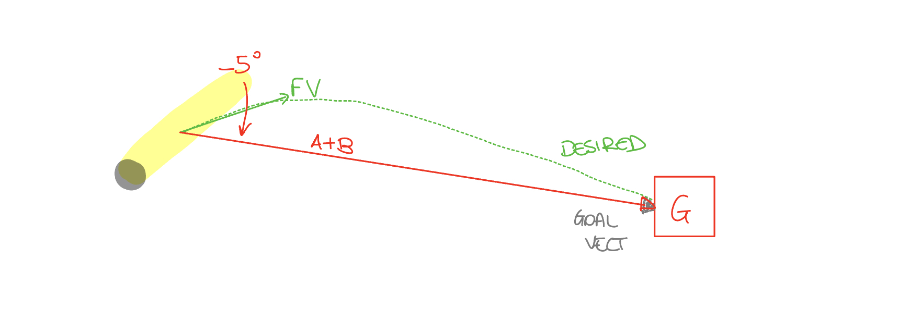

# A star based motion planning, using Motion Primitives
This motion planning algorithm is based on A*; however, unlike the classic approach, it does not rely on a predefined grid to determine a trajectory. Instead, we only have a starting position, a goal position, and a constrained environment (i.e., the tank). Therefore, Motion Primitives are essential, as they allow us to simultaneously generate and search the grid while planning the trajectory.

The general algorithm follows these steps:
- **Select the Best Node (BN)**: identify the best node from the `open_set`, prioritized by the `f_cost` function
- **Generate Motion Primitives (MP)**: generate a set of MP originating from the selected Best Node (BN)
- **Evaluate each primitive**: check whether SAM remains within the free space along the entire primitive, and determine if SAM, following the trajectory, reaches the goal area
- **Update the `open_set`**: store the valid vertices (the last point of each valid primitive) in the `open_set`, computing their `f_cost`
- **Repeat until completion**: continue until the goal is reached or no vertices remain in the `open_set`

## Select the Best Node (BN)
In the developed algorithm, the `heapq` library was used to reduce the computational time required to identify the cheapest node. By leveraging `heapq`, we efficiently managed node selection using the `.heappush()` and `.heappop()` functions, which maintain a priority queue ordered by the `f_cost` function.

## Generate Motion Primitives (MP)
Motion primitives are generated based on SAM's current state, which is stored in each vertex of the grid. These primitives are created by varying the applied input. The image below illustrates the generated primitives from an initial state where SAM is stationary and has no rotation. 

As shown, the final primitives involve movements in all three dimensions, specifically:
- stern input, ds $\in [-7,7]$ degrees
- rudder input, dr $\in [-7, 7]$ degrees
- RPM, RPM1 and RPM2 $\in[-1000, 1000]$ rpm
- $V_{bs} \in [0, 100]$ %
- $l_{cg} \in [0, 100]$ %

Since the input values are continuous, they must be discretized using a `step_input`.



In this algorithm, the length of the primitives is not fixed; instead, it varies based on the alignment of the current velocity with the goal. The more aligned the velocity is, the longer the primitive becomes. This approach allows SAM to move quickly toward the goal when it is perfectly aligned. To determine the `computedSpan` for each primitive, a decreasing exponential function is used:
```math
computedSpan(\alpha) = maxValue\cdot e^{ln(\frac{minValue}{maxValue})\cdot \alpha \cdot \frac{1}{stepAngle}}
```
where:
- maxValue is the maximum possible value of computedSpan
- minValue is the minimum possible value of computedSpan
- $\alpha$ is the function's variable, representing the misalignment
- stepAngle is the minimum angle $\alpha$ at which computedSpan equals maxValue


## Evaluate Generated Primitives
Each point of the primitive is generated for the center of gravity, here considered as the geometrical center of SAM.
After generating the motion primitives for the current state, we need to filter them based on their validity. The following conditions are checked:
- **Free Space:** SAM remains within the free space while following the primitive
- **Goal Area:** SAM reaches the goal area while following the primitive

A primitive will be considered valid if the **Free Space** condition is satisfied, meaning that SAM remains within the boundaries of the tank throughout the entire primitive.

### Free Space
Since SAM operates in a convex environment (the tank), we check for collisions with the walls by generating two black spheres at the front and aft of SAM, each with the same radius as SAM itself, as shown below. SAM is considered to be free from collisions with the environment if no points within the two spheres are colliding with the walls. To perform this check, we restrict the boundaries of the tank by the radius of these spheres. This approach allows us to simply verify whether the centers of the spheres are colliding with the restricted environment. This method is feasible because the environment is convex, and no obstacles other than the walls are considered.



### Goal Area
Similar to the **Free Space** check, we verify if either the center of gravity (represented by each vertex of the primitive) or one of the centers of the two spheres lies within the goal area, as defined by the map. If this condition is met, the next iteration of the **A star algorithm** will focus solely on reconstructing the path without generating new primitives.

## Update Open Set
As mentioned earlier, the `open_set` hierarchy is updated based on the $f_{cost} = \frac{g_{cost}^2 + h_{cost}^2}{g_{cost}}$ (Adaptive A star), where:
- $f_{cost}$ is the cost used to select the best node from which to generate primitives
- $g_{cost}$ is the length of the path to reach that vertex
- $h_{cost}$  is the heuristic, representing the "remaining" length of the path 

### Computing $g_{cost}$
In this algorithm, $g$ is computed using the `computeCost()` function. Two approaches are available:
- *(Default)* Using the straight-line distance between two steps of the same primitive (time distance defined with the `DT_PRIMITIVES` global variable) 
- Using the current acceleration between the two steps of the primitive

### Computing $h_{cost}$
The purpose of the heuristic is to evaluate which vertex is optimal based on three factors:
- Distance to the goal
- Best orientation with respect to the goal
- Best velocity orientation with respect to the goal 

The ideal case is when the current velocity vector and SAM’s forward (or backward) orientation are perfectly aligned with each other and with the goal. To evaluate the heuristic cost, different STEPS are taken.

#### STEP 1: Find Best Orientation
The best orientation (either forward or backward) is the one with the smallest angle relative to the `goal_vector` (the vector connecting the current center of gravity to the center of the goal area). In the image showed below, the best orientation is the `forward` vector.


#### STEP 2: Compute `final_vector` (FV)
The Final_Vector (FV) is computed by summing the two vectors:
- `best_orientation_vector` (STEP 1) 
- `current_velocity_vector`(v). 

An example is shown in the image below.


#### STEP 3: Compute angle with `goal_vector`
The angle $\alpha$ is the one between the computed `final_vector` and the `goal_vector`.


#### STEP 4: Compute $h_{cost}$
There are two cases for computing h:
- **$\alpha < max(\alpha_{actuator})$** (7 degrees for SAM): in this case, h is simply the straight line distance from the current state to the goal (as in standard A star)

- **Otherwise** : in this case, h is the sum of:
    - The distance required to fully stop SAM in the $\alpha-7°$ direction (`A`)
    - The straight line distance from where SAM stops, to the goal (`B`)
- 

The distance `A` is computed following the law of uniformly accelerated motion:
```math
s = s_0 + v_0t + \frac{1}{2}at^2
```
and knowing the deceleration (`dec`) and the current velocity norm:
```math
A = \frac{-v^2}{2 \cdot dec}
```
In our algorithm, we are already considering the current velocity norm when computing the `final_vector`, thus we write:
```math
A = \frac{-1^2}{2 \cdot dec}
```
where we consider `dec` as a tuning parameter depending on SAM's dynamics.

On the other hand, the distance `B` is computed using the cosinus rule. Knowing the `goal_vector_norm` and `A`, `B` can be written as:
```math
B^2 = norm_{goalVector}^2 + B^2 - 2\cdot norm_{goalVector}\cdot B\cdot cos\alpha
```
where $\alpha$ is the angle between `goal_vector_norm` and `B` that we have computed in the previous steps.